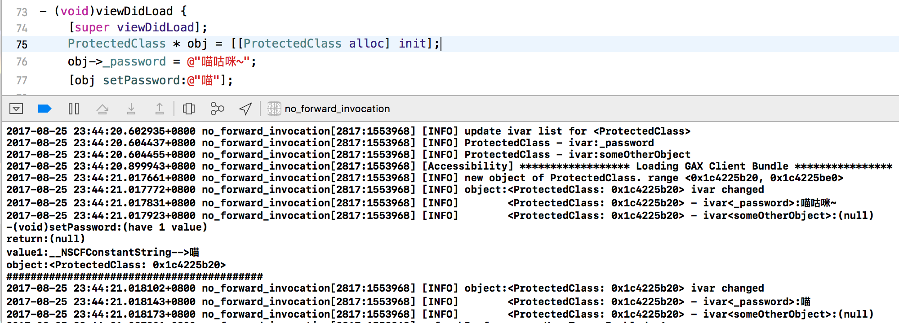

# Meow

Meow is a small library that monitoring ivar changes for all objects of given class. 

For details, you may refer to my blog, [Monitoring Ivar Changes in Objective-C](https://blog.0xbbc.com/2017/08/monitoring-ivar-changes-in-objective-c/)

### Usage
```objc
[Meow initWithClassName:@"ProtectedClass"];
```

### FAQ
`But why on earth do we need the Meow? Since [BigBang](https://github.com/codesourse/BigBang/) or [ANYMethodLog](https://github.com/qhd/ANYMethodLog/) already does great job...`

The answer is simple, ivar can be directly accessed instead of via a setter method. For example, 

```objc
@interface ProtectedClass : NSObject {
@public
        NSString * _password;
}
@property (nonatomic, getter=password, setter=setPassword:) NSString * password;
@end

/// ...omited...
ProtectedClass * obj = [[ProtectedClass alloc] init];
obj->_password = @"喵咕咪~"; // directly access, undectectable in BigBang or ANYMethodLog
[obj setPassword:@"喵"]; // BigBang or ANYMethodLog dectectable
/// ...omited...
```

### Screenshot


